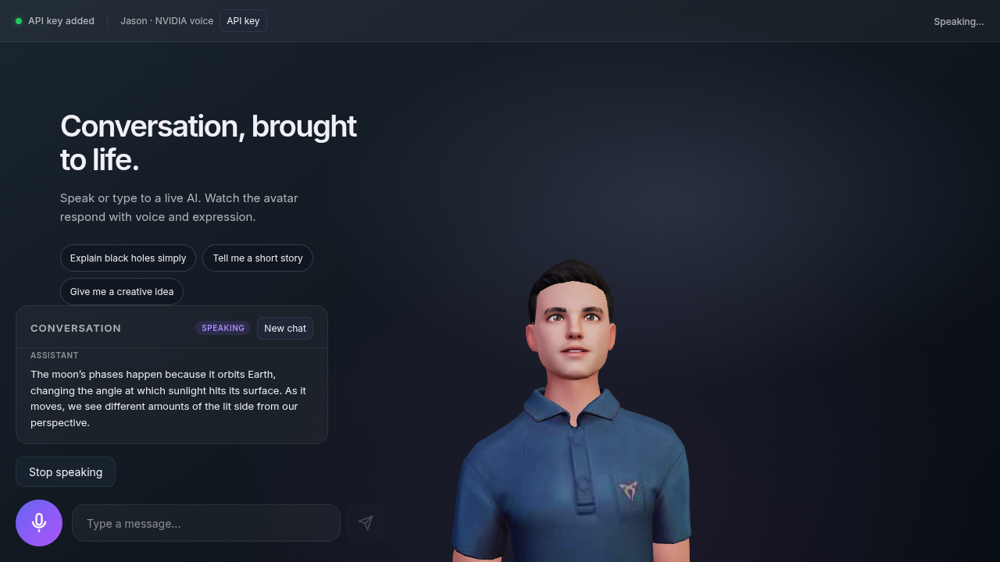

# Virtual Assistant

**[Try the live demo](https://3bdrahman.github.io/virtual-assistant-demo/)** · [Watch an 11-second silent walkthrough](docs/showcase/demo.webm)

Talk to a live AI through a 3D avatar. Chat text streams into the transcript while complete early phrases are synthesized and played as streamed PCM. The avatar's mouth follows pronunciation estimates refined by audio timing. You can also record a question; transcription starts **after** recording stops.

The public demo asks for your own NVIDIA API key. It stays in page memory, is sent through the [API relay](https://virtual-assistant-pages-api.onrender.com/api/health), and disappears on reload. The relay does not use an owner key in this mode. The free API host may take about a minute to wake on a first visit.



[See the first-visit key screen](docs/showcase/first-visit.png). The walkthrough shows a real provider conversation through the local visitor-key relay; it has no audio track and begins after key entry. No credential appears in the recording or screenshots.

## How it works

| Part | Responsibility |
| --- | --- |
| React, Three.js, Web Audio | Transcript, controls, 3D avatar, streamed PCM playback and estimated mouth poses |
| Express relay | Fixed NVIDIA endpoints, visitor-key forwarding, request limits, timeouts, and cancellation |
| NVIDIA NIM | Streamed chat, Magpie speech, and Parakeet transcription |

The client sends complete early phrases to Magpie before the chat reply is finished. Speech buffers play in order; Stop and New chat cancel pending chat, speech, and animation. Failed turns stay visible for Retry. The visitor key is held only in memory and is never put in a URL, browser storage, or the repository.

## Run locally

Use Node.js 22+ and a NVIDIA API key:

```bash
cd app
cp .env.example .env
# Set NVIDIA_API_KEY in .env; keep this file private
npm ci
npm run dev
```

Open <http://localhost:5173>. Local development uses a server-side key; the public Pages deployment uses visitor keys. For a production-style local run, use `npm run build && npm start` from `app/`. See the [app guide](app/README.md) and [Pages deployment guide](docs/github-pages-demo.md) for configuration and verification commands.

## Limits

- Microphone transcription begins after the recording is complete; it does not stream live captions.
- Lip timing is a pronunciation and acoustic estimate, not exact phoneme alignment. Names, accents, rapid speech, and unsupported languages can be imperfect. [Articulation details](docs/mouth-articulation.md).
- WebGL, audio output, or microphone permissions can be unavailable. Text conversation remains usable when the avatar or speech path cannot run; the UI reports the failure.
- Provider latency, quota, and the Render free host's cold starts affect first response time. The demo has no prerecorded answers or offline simulation.

Run `npm run verify` and `npm audit --omit=dev --audit-level=high` inside `app/` for the CI gates. Browser regressions and explicit live-provider checks are documented in the [app guide](app/README.md).
