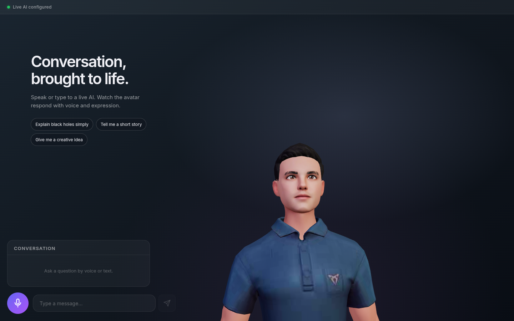

# Virtual Assistant

**[Open the live demo](https://3bdrahman.github.io/virtual-assistant-demo/)** — enter your NVIDIA API key to start. The key is kept in page memory and cleared on reload. The free API host may take about a minute to wake after inactivity.

A live AI conversation with a 3D avatar. Ask a question by text or voice, read the streamed response, and hear the avatar speak. Local use can rely on a server key; the GitHub Pages demo accepts each visitor’s own NVIDIA key in page memory.



The runnable project is [app/](app/). It uses React and Three.js in the browser, an Express server for the API key and provider calls, and NVIDIA chat, Parakeet transcription, and Magpie speech. There are no scripted demo answers.

## Run locally

Use Node.js 22+ and a server-side NVIDIA API key:

```bash
cd app
cp .env.example .env
# Add your server-side NVIDIA_API_KEY to .env
npm ci
npm run dev
```

Open `http://localhost:5173`. For a production-style run, use `npm run build && npm start` inside `app/`. The setup, deployment notes, and validation commands are in the [app guide](app/README.md).

The app shows the real service state. If the server or provider key is unavailable, it explains why live conversation cannot start. Text chat remains available when WebGL or speech output is unsupported.

For the public visitor-key version, see [GitHub Pages deployment](docs/github-pages-demo.md). Pages hosts the frontend; a separate HTTPS API relay is required because NVIDIA’s hosted endpoints do not currently permit direct browser calls.
