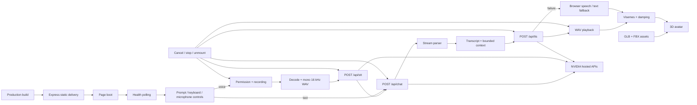

# Demo reliability audit — September 28, 2026

Scope: the live NVIDIA-backed application in `app/`, all four API routes, and the connections between input, conversation, speech, and avatar rendering. This is a local demo-readiness audit. No deployment, production configuration, dependency upgrades, or credential changes were made.

Status: completed for the local demo scope. API, audio, live-provider, browser functional, and visual regression checks passed. Deployment and physical-device limits are listed below.

**Avatar follow-up:** user testing subsequently exposed missing mouth movement and idle restarts that the original checks did not cover. See the [animation repair and corrected verification scope](avatar-animation-fix.md). The earlier avatar checks established rendering and audio playback, not visible lip movement or continuous idle playback.

## Application graph



## Plan and stop condition

Map each section and integration, reproduce failures, add focused regressions, fix concrete defects, then verify the built application in Chromium and the actual configured provider. Preserve the live-demo contract: provider substitutes exist only in tests. Stop after the section matrix has passing evidence or an explicit environment limitation. Avoid deployment changes and new dependencies.

## Traversal and verification matrix

| Section and subsections | Connections and cases exercised | Evidence |
| --- | --- | --- |
| Boot, status bar, availability notice | `/api/health` → enabled controls; configured, missing key, malformed payload, offline, recovery without reload; no key exposure | `nim.test.js`, `api-boundaries.test.js`, browser health scenarios |
| Introduction, suggestions, text form | Suggested prompt → API; keyboard Enter, blank input, Unicode and literal script text, 8,000-character input cap, controls disabled during work | Browser typed and keyboard scenarios; API invalid input matrix |
| Conversation panel and history | Tokens → committed answer; failed/cancelled turns remain labelled and excluded from provider history; successful retry clears input; seven-turn test crosses context window | Browser typed, cancellation, and history scenarios |
| Streaming client | Split UTF-8 bytes, CRLF and multiline SSE, no-space fields, terminal marker without EOF, incomplete/malformed/oversized streams, header/body deadlines, reader cleanup | `nim.test.js` |
| Microphone control | Grant, simulated denial, pending permission cancellation, bounded recording, hardware stop, empty transcription, usable text after failure | Real Chromium MediaRecorder with a synthetic microphone source; microphone browser scenario |
| WAV conversion | Mono 16 kHz PCM output; resampling; empty/oversized/overlong data; decode/render deadlines; abort before upload | `wav.test.js`, real browser recording → API |
| Transcription API | WAV → multipart provider call → text → chat; complete WAV validation, extra RIFF chunks, invalid format, malformed transcript, byte limits, chunked 413, retries after timeout | `server.test.js`, `api-boundaries.test.js`, browser voice scenario, live round trip |
| Chat API and provider boundary | Turn ordering, role/content/count limits, JSON/media types, model selection, provider auth/quota/server failures, concurrency/rate limits, disconnect, backpressure, deadline recovery | Server and API boundary suites |
| Speech API | Text → multipart Magpie request → WAV; server-selected voice, 2,000-character limit, invalid/empty provider responses, retry after timeout | Server/API tests, browser playback, live round trip |
| Playback and speech fallback | WAV decoding and volume-driven visemes; cancellation during decode; stale utterance callbacks; browser speech watchdog; text fallback; disposal and reuse after StrictMode cleanup | `audioLipSync.test.js`, browser speech and stop scenario |
| Avatar and animation assets | GLB + both FBX assets load; real WebGL scene alongside a spoken reply; unavailable WebGL; failed assets caught outside the renderer; text remains usable | Browser avatar and scene fallback scenarios; screenshot evidence |
| Responsive UI and accessibility basics | 320×568, 390×844, 844×390, 1280×800; long unbroken text, complete control bounds, keyboard submission, labelled controls, offline/error states | Browser viewport/keyboard scenarios and visual inspection |
| Static delivery and process lifecycle | Built entry/assets; missing assets give 404 instead of HTML; unknown APIs give JSON 404; security headers; startup failure; SIGTERM drain with bounded forced close | `server.test.js`, `api-boundaries.test.js` |
| Release and secret isolation | Tests/lint/build; dependency audit; built files scanned for configured key and environment files; CI and Render verification gates | Commands below, `.github/workflows/verify.yml`, `render.yaml` |

## Defects fixed

| Finding | User or operational impact | Change |
| --- | --- | --- |
| Browser requests lacked complete deadlines and cancellation | A stalled connection could hold the UI indefinitely | 45-second request deadline, cancellation signals through conversion/fetch/body consumption, Cancel request and Stop speaking controls |
| SSE waited for EOF after completion and assumed one wire format | Finished answers could hang; valid fragmented events could fail | Event parser handles UTF-8, CRLF, multiline data, terminal marker, size limits, and prompt reader cleanup |
| Async work could outlive its request | Cancelled work could interfere with later conversations | Request identity guards, cancelled-turn labels, preserved retry input, cancellation on unmount |
| Microphone/audio work was insufficiently bounded | Long recordings, stalled decode, or missing speech completion could retain resources | 60-second recording cap; byte/duration limits; 15-second audio deadlines; speech watchdog; track/node/context cleanup |
| Upload validation accepted incomplete WAV headers | Malformed input reached the billable transcription provider | Complete RIFF/PCM/data validation, including nonempty audio and consistent metadata |
| Oversized chunked uploads reset the response | Client received a connection failure instead of a useful error | Controlled JSON 413 response and upload drain |
| Proxy streams ignored backpressure and retained resources | Slow/disconnected clients could retain upstream work and request slots | Abort-aware drain waits, upstream body cancellation, reader release, inactive limiter cleanup |
| Provider success payloads were trusted too readily | HTML/invalid transcript/empty audio appeared as successful calls | Explicit response type and shape checks with safe JSON failures |
| TTS input limit exceeded NVIDIA's documented contract | Avoidable provider rejections during speech | 2,000-character server limit; browser fallback remains available |
| Missing assets fell through to the SPA entry | Broken asset requests returned misleading HTML success | Real 404s for missing static assets and JSON 404s for unknown API routes |
| Failed avatar asset loads reached the renderer as global errors | Console/runtime error despite a recoverable asset failure | Asset loading moved to the app's existing Suspense/error boundary |
| Long tokens overflowed phone transcripts | Conversation text extended outside the panel | Wrapping for unbroken text and preservation of line breaks |
| Avatar fallback notice overlapped content on an offline phone | Heading and transcript were difficult to read | Notice placed in normal layout flow; flexible transcript sizing and overlap assertions |
| Releases only enforced compilation | Runtime regression tests could be bypassed by deployment | `npm run verify`, GitHub Actions tests/lint/build/audit, Render test/lint/build gate |

## Validation evidence

- Baseline: **32 passing tests**.
- Final API/audio/client regression suite: **69 passing tests**, no failures or skips, Node **22.22.3**.
- Chromium integration suite: **10 scenario groups passed**, including explicit notice-overlap assertions. A targeted follow-up on the final CSS build also confirmed fully visible empty-transcript text, no overlapping notice, and unclipped controls at 320×568. Results: [browser evidence](demo-audit-evidence/demo-e2e-results.json).
- `npm run lint`: passed. This JavaScript project has no configured TypeScript typecheck; Vite compilation, lint, syntax checks, and behavior tests provide the applicable checks.
- `npm run build`: passed. The lazy avatar/Three.js chunk remains approximately 956 kB uncompressed / 257 kB gzip and produces Vite's size warning. Conversation UI is loaded independently.
- `npm audit --json`: **0 vulnerabilities** across the installed production and development dependencies. Production-only audit also passed.
- Built artifact scan: **8 files**, no configured server key and no `.env` files included. No credential value was printed.
- Live provider check at **2026-09-28 05:46 UTC**: health configured; chat produced **38 characters**; Magpie produced **192,556 bytes** of WAV; Parakeet recognized **39 characters**. All stages passed. This was a real three-call NVIDIA round trip, separate from test fixtures.
- Production entry process was started and terminated with SIGTERM in a regression test: exited cleanly with code 0.

[Verification summary](demo-audit-evidence/verification-summary.json) · [Avatar screenshot](demo-audit-evidence/avatar-desktop.png) · [Small-phone transcript](demo-audit-evidence/layout-mobile-small.png) · [Offline phone](demo-audit-evidence/offline-mobile.png) · [Landscape](demo-audit-evidence/layout-landscape.png).

### Reproduce

Run from `app/`:

```bash
npm run verify
npm audit --omit=dev
PLAYWRIGHT_MODULE=/absolute/path/to/playwright/index.mjs npm run test:e2e
# Explicit provider-quota use:
npm run test:live
```

The browser script uses Playwright from the QA environment rather than adding a project dependency. `CHROMIUM_EXECUTABLE_PATH` selects an existing browser and `E2E_ARTIFACT_DIR` preserves JSON/screenshots. Without the artifact setting, temporary microphone data and browser/server resources are cleaned up. `E2E_SCENARIO` can select a scenario by a substring of its name for reproductions.

## Evidence interpretation and cleanup

The browser harness launches the actual built application and Express routes, with controlled NVIDIA responses. It uses real browser audio decoding and recording from a synthetic source; denial and pending-permission cases are controlled substitutes. A separate live check covers the configured NVIDIA endpoints. Browser tests cover Chromium, not every browser/device combination.

Earlier runs exposed both product failures and harness defects. Harness fixes included exact textbox selectors, waiting for speech setup before asserting input reset, classifying deliberate SSE cancellation correctly, and keeping mock abort handlers alive for stalled streams. The product fixes were rerun afterward. Successful fixture replies are never exposed as a product demo mode.

Owned test servers, browser contexts, synthetic audio files, and child server processes are closed/removed. Durable evidence is retained in `docs/demo-audit-evidence/`. No unrelated process or user files were removed. Git metadata is unavailable in this workspace, so there is no commit or reliable baseline Git diff; the changed surfaces are listed below.

## Remaining release limits

- No deployed Render/HTTPS-origin test was performed. Confirm forwarded-IP behavior before enabling `TRUST_PROXY`; verify cold starts and microphone permissions on the deployed origin.
- `/api/health` checks process/configuration health, not NVIDIA entitlement, quota, or uptime. Use the explicit live check for release readiness.
- Rate/concurrency limits remain per IP and per Node process. Multiple instances need a shared limiter; public demo usage needs provider quotas.
- Physical microphone/speaker quality, browser-native voice availability, and Safari/Firefox/mobile-device behavior remain unverified. Chromium synthetic media does not prove those hardware paths.
- This is demo verification, not a sustained-load benchmark or a claim of production availability. The avatar bundle size remains a first-load performance consideration.

## Changed surfaces

- UI and integration: `src/App.jsx`, `src/index.css`, `src/components/ChatPanel.jsx`, `MicButton.jsx`, `AvatarScene.jsx`, `Experience.jsx`, `Avatar.jsx`.
- Browser services: `src/services/nim.js`, `audioLipSync.js`, `wav.js`, `src/utils/webgl.js`.
- Server: `server/index.js`.
- Regressions: `tests/nim.test.js`, `server.test.js`, `api-boundaries.test.js`, `audioLipSync.test.js`, `wav.test.js`, `webgl.test.js`, `demo.e2e.mjs`.
- Release tooling/docs: `scripts/live-smoke.mjs`, `package.json`, `app/README.md`, `render.yaml`, `.github/workflows/verify.yml`, this report and evidence.

Provider contracts were checked against NVIDIA's [chat reference](https://docs.api.nvidia.com/nim/reference/llm-apis), [Parakeet API](https://build.nvidia.com/nvidia/parakeet-ctc-1_1b-asr/api), [Magpie API](https://build.nvidia.com/nvidia/magpie-tts-multilingual/api), and [TTS HTTP reference](https://docs.nvidia.com/nim/speech/latest/reference/api-references/tts/http-tts.html). The latter documents the 2,000-character normalized text limit.
