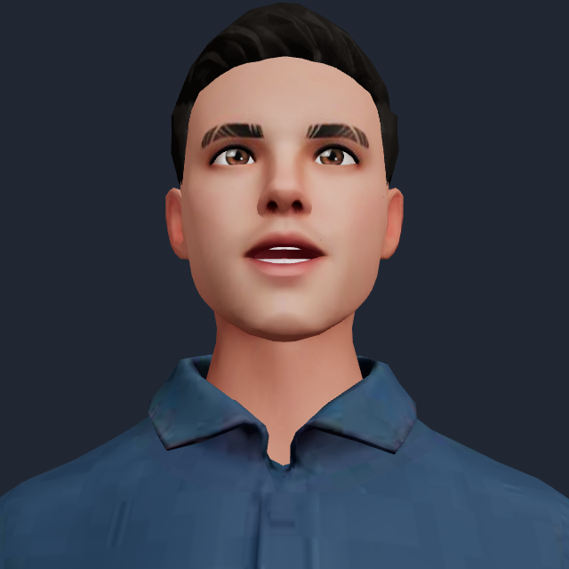
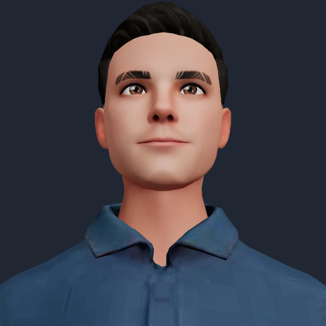

# Mouth articulation refinement

## Acceptance and plan

Keep the existing voice, fast streamed playback, cancellation and avatar model.
Improve recognizable sound shapes and their timing, especially closed lips for
P/B/M, teeth/lip contact for F/V, TH, SH/CH, and rounded vowels. No new package or
hosting dependencies.

The baseline passes 142 tests, but its timeline maps individual written letters
to shapes, gives every space a silence interval, applies fixed secondary shapes,
and stretches the whole phrase to an estimated duration. Its browser regression
proves visible movement, not correct articulation.

1. Verify whether the same hosted NVIDIA voice returns word timing over gRPC.
   Its HTTP PCM stream does not document timing metadata. If the hosted gRPC
   probe succeeds, relay audio immediately and deliver alignment separately;
   never wait for alignment before starting playback.
2. Replace letter mapping with pronunciation units, including common irregular
   words, digraphs, silent letters, vowel pairs, numbers and abbreviations.
3. Use the actual output clock and sample position through stream stalls. Refine
   estimated sound durations against energy, noise and pause cues in received
   PCM; do this in a worker after each phrase arrives, without blocking playback.
   Use real word-boundary events when the browser speech fallback provides them.
4. Blend adjacent sound shapes with short anticipatory transitions. Preserve
   bilabial closure, limit incompatible/open-mouth blends, and calibrate weights
   against the shipped head and teeth morphs.
5. Add regressions before changing behavior: sound sequence, word boundaries,
   acoustic/output timing, quiet closures, packet-size independence,
   cancellation and the existing early-playback contract.
6. Verify real rendered shapes with controlled utterances and the NVIDIA voice,
   then run unit tests, lint, build and streaming/browser regressions. Record
   which timing is measured and which is estimated; do not claim phoneme-perfect
   alignment from broad acoustic cues.

## Compatibility boundaries

The existing HTTP/WAV and HTTP/PCM contracts remain valid for their callers.
Estimated timing is a documented compatibility path when word timing is absent,
not a claimed substitute for measured alignment. Browser speech retains the
existing explicit English male voice selection and text-only behavior.

## Evidence

The [NVIDIA HTTP API](https://docs.nvidia.com/nim/speech/26.07.0/reference/api-references/tts/http-tts.html)
documents audio-only PCM output. The newer
[Riva protocol](https://github.com/nvidia-riva/common/blob/268890b7286031a6d4950e34f7ce13ed0d4ce621/riva/proto/riva_tts.proto)
includes optional word offsets, but two authenticated probes of this demo's
hosted Magpie function returned successful audio with no timing metadata, even
with `enable_word_time_offsets` enabled. The existing HTTP transport is retained.
No gRPC adapter, additional provider request per reply, dependency, or new hosting
service is introduced.

The refinement uses the
[15 Oculus sound shapes](https://developers.meta.com/vr/documentation/unreal/audio-ovrlipsync-viseme-reference/)
already present on the avatar. The stronger open/rounded vowel targets are capped;
P/B/M can hold a full lip seal even when the closure is quiet. Transitions blend
the actual neighboring sounds, rather than adding the same unrelated shapes to
every vowel. The spoken position uses
[Web Audio output timestamps](https://www.w3.org/TR/webaudio-1.0/#dom-audiocontext-getoutputtimestamp)
where available, with the existing latency estimate as a compatibility path.

### Rendered comparison

After switching from an open vowel to a quiet bilabial and advancing four 60 Hz
frames, the old head retained an open-vowel weight of **0.553** with no PP closure.
The new head reached **0.995 PP closure**, with the old vowel reduced to **0.001**.
These are controlled shape-transition measurements, not a percentage estimate of
phoneme accuracy. [Raw results](mouth-articulation-evidence/articulation-results.json).

| Before | After |
| --- | --- |
|  |  |

The browser also exercised all 49 predicted sound units on an actual 4.69-second
NVIDIA Jason sample. The worker returned sample-timed poses successfully, including
trailing silence. This demonstrates the real playback/worker/rendering path; the
sample does not carry reference phoneme labels and cannot establish exact sync.

### Checks

- 161 unit/API tests passed, including phonetic contrasts, silent letters,
  vowel glides, numbers, quiet consonants, sample packet boundaries, output-clock
  timing, worker cancellation, and browser word boundaries.
- Lint and production build passed. The worker adds about 2.7 kB; the existing
  large avatar-scene bundle warning remains. No separate typecheck is configured.
- The streaming browser regression started playback while both responses were
  still held open (169 ms in this controlled run), recorded zero scheduled gaps,
  and verified cancellation without stale audio restarting.
- The existing GPU regression passed: moving mouth shapes, reset on Stop,
  repeated replies, and idle-animation continuity.
- All four Pages browser scenarios passed, including visitor-key isolation,
  cancellation, and the `/demo/` asset base path.
- `npm run test:articulation` renders and checks actual model morphs. Set
  `LIPSYNC_BASELINE_MODULE` to the old `audioLipSync.js` for before/after comparison;
  `LIPSYNC_VOICE_SAMPLE` can supply the documented utterance recorded with Jason.
  Playwright configuration follows the other browser tests.

## Scope and remaining limits

`audioLipSync.js` now shares one articulation path between PCM and browser speech.
`visemePronunciation.js` handles pronunciation estimates; `speechTiming.js` and
its worker refine durations from coarse acoustics; `visemeArticulation.js` controls
pose strength and neighboring transitions. The existing spring utility accepts
an optional release time so lip closure can be faster without changing head motion.

This is still estimated lip sync, not a trained phoneme recognizer or provider
phoneme alignment. Irregular words, names, accents, rapid speech, and languages
outside the English rules can remain imperfect. If worker timing is unavailable,
the pronunciation-based animation continues; audio startup never waits for it.
